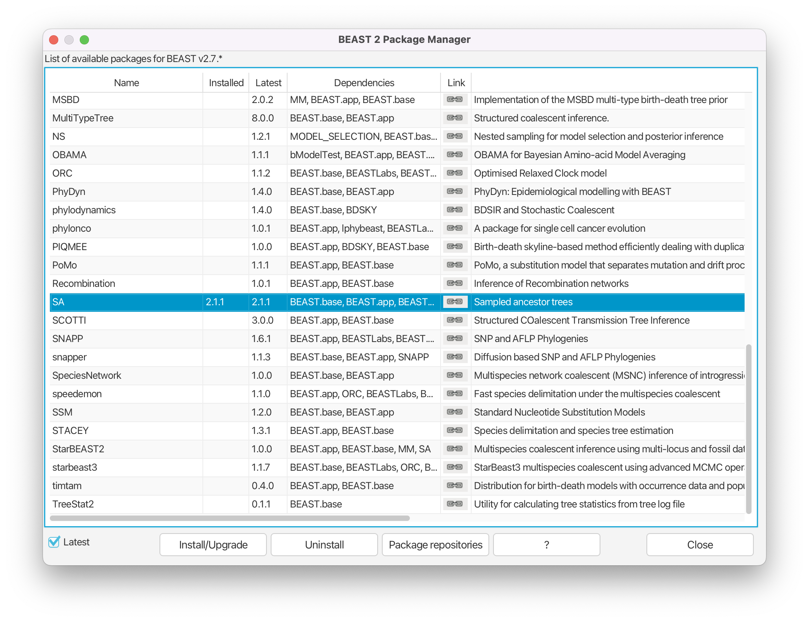
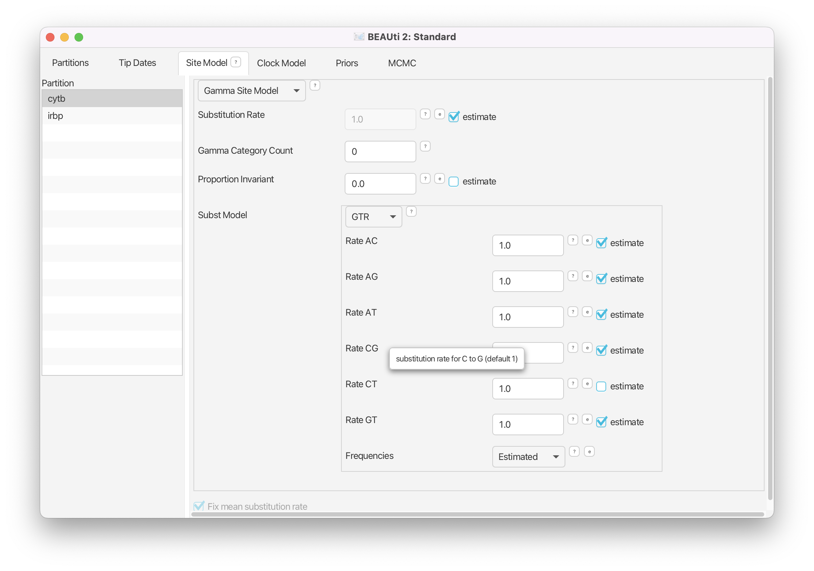
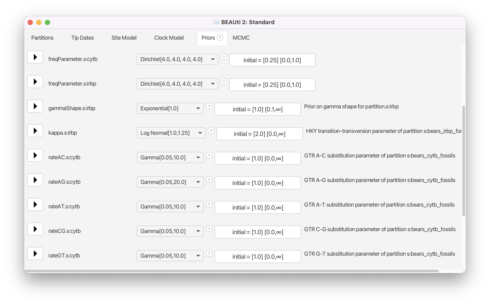
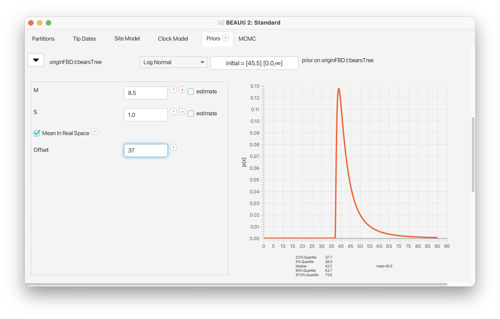
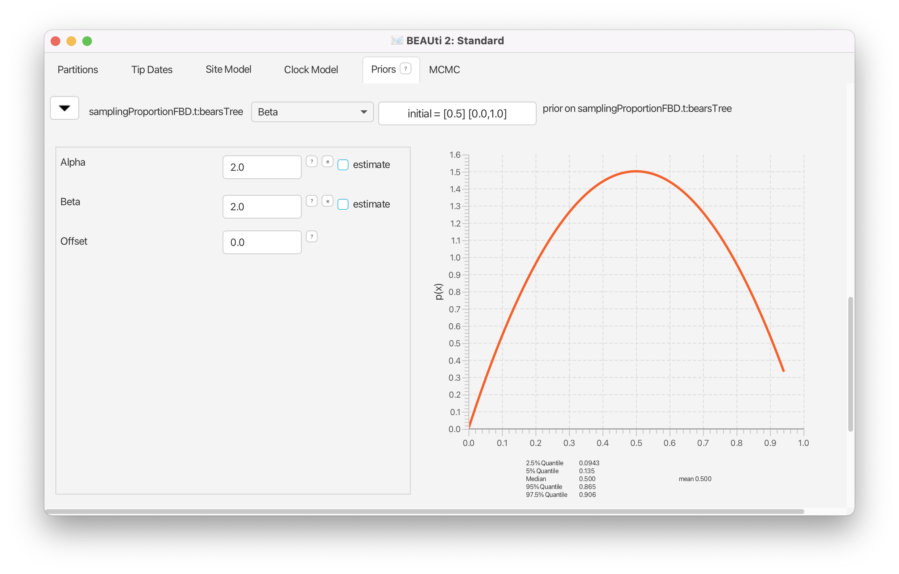
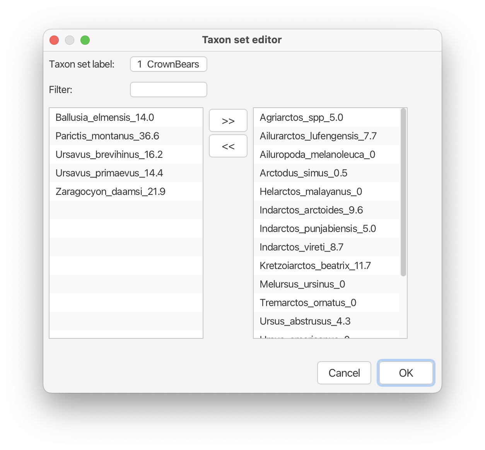
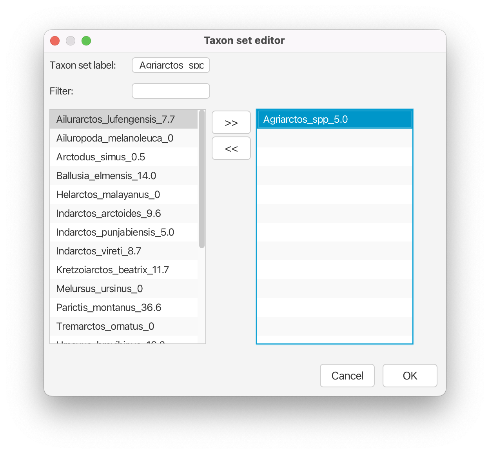
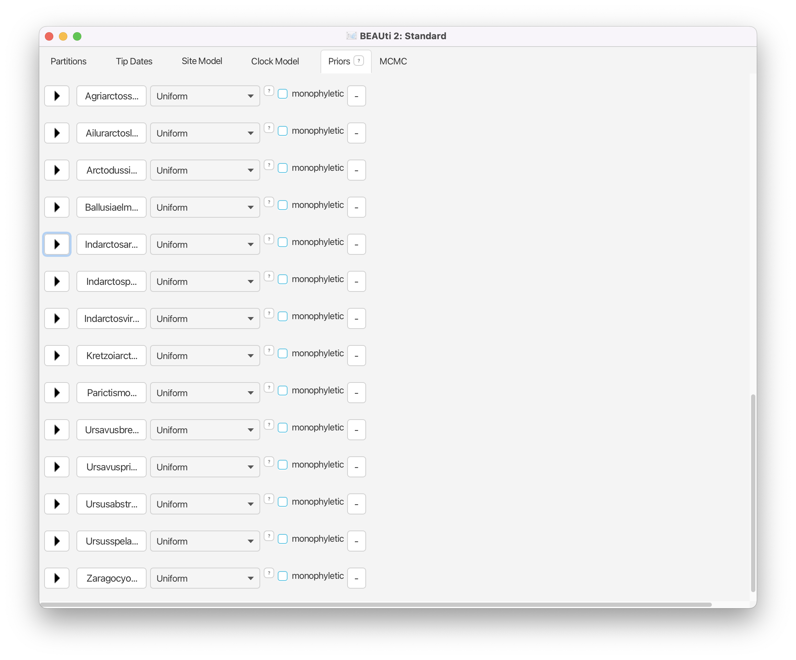

# Background

Central among the questions explored in biology are those that seek to understand the timing and rates of evolutionary processes. Accurate estimates of species divergence times are vital to understanding historical biogeography, estimating diversification rates, and identifying the causes of variation in rates of molecular evolution. 

This tutorial will provide a general overview of divergence time estimation and fossil calibration using a stochastic branching process and relaxed-clock model in a Bayesian framework. The exercise will guide you through the steps necessary for estimating phylogenetic relationships and dating species divergences using the program BEAST v2.7.x.

This tutorial is available in two formats.  A link to a PDF can be found in the column on the left-hand side of this page; the PDF is a more in-depth version of the tutorial, which includes a lot of the background about the fossilized birth-death model. Below is a shorter version which is focused on the more practical aspects of implementing the divergence time analysis.

# Programs used in this Exercise 

### BEAST2 - Bayesian Evolutionary Analysis Sampling Trees 2

[BEAST2](http://www.beast2.org) is a free software package for Bayesian evolutionary analysis of molecular sequences using MCMC and strictly oriented toward inference using rooted, time-measured phylogenetic trees . The development and maintenance of BEAST is a large, collaborative effort and the program includes a wide array of different types of analyses. This tutorial uses the BEAST v{{ page.beastversion }}. 

### BEAUti - Bayesian Evolutionary Analysis Utility

BEAUti2 is a utility program with a graphical user interface for creating BEAST2 input files which must be written in the XML. This application provides a clear way to specify priors, partition data, calibrate internal nodes, etc.

Both BEAST2 and BEAUti2 are Java programs, which means that the exact same code runs, and the interface will be the same, on all computing platforms. The screenshots used in this tutorial are taken on a Mac OS X computer; however, both programs will have the same layout and functionality on both Windows and Linux. BEAUti2 is provided as a part of the BEAST2 package so you do not need to install it separately.

### Any programmer-friendly text editor

We will need to edit the XML files produced by BEAUti, for which we'll need a text editor. It's best to use one designed for programmers as these include nice features such as syntax highlighting, which makes the code more reader-friendly. [Sublime Text](https://www.sublimetext.com) is a good option which is available for MacOS, Windows and Linux.

### TreeAnnotator

TreeAnnotator is used to summarize the posterior sample of trees to produce a maximum clade credibility tree and summarize the posterior estimates of other parameters that can be easily visualized on the tree (e.g. node height). This program is also useful for comparing a specific tree topology and branching times to the set of trees sampled in the MCMC analysis. 

### Tracer

[Tracer](http://beast.community/tracer) is used for assessing and summarizing the posterior estimates of the various parameters sampled by the Markov Chain. This program can be used for visual inspection and assessment of convergence and it also calculates 95\% credible intervals (which approximate the 95\% highest posterior density intervals) and effective sample sizes (ESS) of parameters. We will be using Tracer v{{ page.tracerversion }}.

### FigTree

[FigTree](http://tree.bio.ed.ac.uk/software/figtree) is an excellent program for viewing trees and producing publication-quality figures. It can interpret the node-annotations created on the summary trees by TreeAnnotator, allowing the user to display node-based statistics (e.g. posterior probabilities) in a visually appealing way.

# Practical: Divergence Time Estimation

This tutorial will walk you through an analysis of the divergence times of the bears. The occurrence times of 14 fossil species are integrated into the tree prior to impose a time structure on the tree and calibrate the analysis to absolute time. Additionally, an uncorrelated, lognormal relaxed clock model is used to describe the branch-specific substitution rates.

## The Data

The data files and pre-cooked output files can be downloaded from the panel on the left. The analysis in this tutorial includes data from several different sources.
We have molecular sequence data for eight extant species, which represent all of the living bear taxa. The sequence data include interphotoreceptor retinoid-binding protein (irbp) sequences (in the file **bears\_irbp\_fossils.nex**) and 1000 bps of the mitochondrial gene cytochrome b (in the file  **bears\_cytb\_fossils.nex**). If you open either of these files in your text editor or alignment viewer, you will notice that there are 22 taxa listed in each one, with most of these taxa associated with sequences that are entirely made up of missing data (i.e., **?????**). This is because the NEXUS files also contain the names of 14 fossil species, that we will include in our analysis as calibration information for the fossilized birth-death process.
For these extinct taxa, we must provide an occurrence time for each taxon sampled from the fossil record. This information is obtained from the literature or fossil databases like the [Paleobiology Database](http://paleobiodb.org/) or the [Fossil Calibration Database](http://fossilcalibrations.org/), or from your own paleontological expertise. The 14 fossil species used in this analysis are listed in Table \ref{bearFossilTable} along with the age range for the specimen and relevant citation.
The final source of data required for our analysis is some information about the phylogenetic placement of the fossils. This prior knowledge can come from previous studies of morphological data and taxonomy. Ideally, we would like to know exactly where in the phylogeny each fossil belongs. However, this is uncommon for most groups in the fossil record. Often, we can place a fossil with reasonable resolution by assigning it to some total group. For example, if a fossil specimen has all of the identifying characters of a bear in the subfamily Ursinae, then, we can create a monophyletic group of all known Ursinae species and our fossil. Here, we would be assigning the fossil to the *total group Ursinae*, meaning that the fossil can be a crown or stem fossil of this group. For some fossils, we may have very little data to inform their placement in the tree and perhaps we may only know that it falls somewhere within our group of interest. In this case, we can account for our uncertainty in the relationship of the fossil and all other taxa and allow MCMC to sample all possible places where the fossil can attach in the tree. For the bear species in our analysis, we have some prior knowledge about their relationships. Four out of five of the clades shown in Figure \ref{fig:1} are defined in the NEXUS file **bears\_cytb\_fossils.nex** as **taxsets** in the **sets** block. The one clade that is not included in the data file will be created using the BEAUti options.

<figure>
 
 
 <figcaption>Figure 1: The phylogenetic relationships of crown and stem bears based on taxonomy and morphological data. The resolution of monophyletic clades is based on well-supported previous analyses. Monophyletic clades are indicated with labeled circles. In addition to the root node (R), there are 5 nodes defining clades containing both fossil and extant species. The origin of the tree is indicated with a red square. The time of this node represents the start of the diversification process that generated these lineages. The extant lineages are shown with heavy, solid lines and the fossil lineages are dotted lines.</figcaption>
</figure>

## Creating the Analysis File with BEAUti

Creating a properly-formatted BEAST XML file from scratch is not a simple task. However, BEAUti provides a simple way to navigate the various elements specific to the BEAST XML format.

>Begin by executing the BEAUti program.

### Install BEAST2 packages

Next, we have to install the BEAST 2 packages that are needed for this analysis. The packages that we will use called **SA** (Sampled Ancestors) and **ORC** (Optimized Relaxed Clock).

>Open the **Package Manager** by navigating to **File > Manage Packages** in the menu. Install the **SA** package by selecting it and clicking the **Install/Upgrade** button. Do the same for the **ORC** package.

<figure>
 
 
 <figcaption>Figure 2: The BEAST2 Package Manager.</figcaption>
</figure>

> Close the BEAST2 Package Manager and **restart BEAUti** to fully load the packages.

### Import Alignments

Next we will load the alignment files for each of our genes from our NEXUS files.

>Navigate to the **Partitions** window. Using the menu commands **File > Import Alignment**, import the data files **bears\_irbp\_fossils.nex** and **bears\_cytb\_fossils.nex**. 

Now that the data are loaded into BEAUti, we can unlink the site models, link the clock models, link the trees and rename these variables.

> Highlight both partitions (using **shift and click**) and click on **Unlink Site Models** to assume different models of sequence evolution for each gene (the partitions are typically already unlinked by default). Click the **Link Clock Models** button so that the two genes have the same relative rates of substitution among branches. Finally click **Link Trees** to ensure that both partitions share the same tree topology and branching times.

It is convenient to rename some of the variables in the **Partitions** window, so they are easier to understand in the output files.

>Double click on the site model for the cytochrome b gene (**bears\_cytb\_fossils**). Rename this **cytb**. (Note that you may have to hit the return or enter key after typing in the new label for the new name to be retained.) Do the same for the site model for the other gene, calling it **irbp**. Rename the clock model **bearsClock**, and rename the tree **bearsTree**.

<figure>
 
 
 <figcaption>Figure 3: The Partitions window after unlinking the site models, linking the clock models, linking the trees, and renaming the XML variables.</figcaption>
</figure>

### Set Tip Dates

We must indicate that we have sequentially sampled sequences, and when those sequences were collected. We will indicate that the dates are in **years**, even though they are in fact in units of **millions of years**. This is because the units themselves are arbitrary and this scale difference will not matter. Additionally, we will tell BEAUti that the "zero time" of our tree is the present and the ages we are providing are the number of years **before the present**.

>Navigate to the **Tip Dates** panel. Toggle on the **Use tip dates** option. Change **Dates specified** to **year Before the present**.

<figure>
 
 
 <figcaption>Figure 4: Specifying the units and reference point of the fossil dates.</figcaption>
</figure>

Conveniently, we can specify that our dates are included in the taxon names, so that BEAUti can easily extract them for us using the **Auto-configure** option. Obviously, it's better to make this a fairly simple code that doesn't require multiple iterations of searches. Moreover, if this is straightforward, then you will be able to easily eliminate these dates when creating figures from your final summary tree.

>Click on the **Auto-configure** button. Tell BEAUti to **use everything after the last \_**, then click **OK**.

<figure>
 
 
 <figcaption>Figure 5: Specify the text pattern in the taxon names that identifies the tip's age using the `Guess dates` option.</figcaption>
</figure>

You should now see that the tip ages have been filled in for all of the fossil taxa and that the same age is listed in the **Date** and **Height** column for each species.

### Specify the Sites Model

The molecular sequence data sampled for each extant bear species are from two different genes: the mitochondrial cytochrome b gene (**cytb**) and the nuclear interphotoreceptor retinoid-binding protein gene (**irbp**). We will partition these loci into two separate alignments and apply different models of sequence evolution to each one. For the `cytb` gene, we will apply a general-time reversible model with homogeneous rates across sites: GTR. For the nuclear gene `irbp`, we will assume a 2-rate model where transitions and transversions happen at different rates, and that the rates vary across the alignment according to a mean-one gamma distribution: HKY+$\Gamma$.

>Navigate to the **Site Model** window. Select the **cytb** gene and change the **Subst Model** to **GTR**. Toggle on **estimate** for the **Substitution Rate**. Select the **irbp** gene and change the **Subst Model** to **HKY**. To indicate gamma-distributed rates, set the **Gamma Category Count** to 4. Check that the  **Shape** parameter is set to **estimate**. Toggle on **estimate** for the **Substitution Rate**.

<figure>
 
 
 <figcaption>Figure 6: The fully specified site model for the \cl{cytb} gene: GTR.</figcaption>
</figure>

<figure>
 
 
 <figcaption>Figure 7: The fully specified site model for the \cl{irbp} gene: HKY+$\Gamma$.</figcaption>
</figure>

Now both models are fully specified for the unlinked genes. Note that **Fix mean substitution rate** is always specified and we also have indicated that we wish to estimate the substitution rate for each gene. This means that we are estimating the _relative_ substitution rates for our two loci.

### The Clock Model

Here, we can specify the model of lineage-specific substitution rate variation. The default model in BEAUti is the **Strict Clock** with a fixed substitution rate equal to 1. Models for relaxing the assumption of a constant substitution rate can be specified in BEAUti as well. The **Optimized Relaxed Clock** option (provided by the **ORC package**) assumes that the substitution rates associated with each branch are independently drawn from a single, discretized lognormal distribution . The **Random Local Clock** uses Bayesian stochastic search variable selection to average over random local molecular clocks . For this analysis we will use the uncorrelated, lognormal model of branch-rate variation.

>Navigate to the **Clock Model** window. Change the clock model to **Optimized Relaxed Clock**.

The uncorrelated relaxed clock models in BEAST2 are discretized for computational feasibility. This means that for any given parameters of the lognormal distribution, the probability density is discretized into some number of discrete rate bins. Each branch is then assigned to one of these bins. By default, BEAUti sets the **Number Of Discrete Rates** to **-1**. This means that the number of bins is equal to the number of branches. The fully specified Clock Model assumes that the rates for each branch are drawn independently from a single lognormal distribution. The mean of the rate distribution will be estimated, thus we can account for uncertainty in this parameter by placing a prior distribution on its value.

### Priors on Parameters of the Site Models

In the **Priors** panel we will begin by specifying priors for the parameters associated with the sites models. Since we partitioned the two genes, there are parameters for the two different models: 
- exchangeability rates for the GTR model (`rateAC.s:cytb`, `rateAG.s:cytb`, $\ldots$)
- the transition-transversion rate ratio (`kappa.s:irbp`) and the shape parameter of the gamma distribution on site rates (`gammaShape.s:irbp`)
Note that the base frequencies for each of these models are not listed, though they are estimated.

<figure>
 
 
 <figcaption>Figure 8: The Priors window with default (unmodified) settings.</figcaption>
</figure>

We will keep the default priors for the HKY model on the evolution of `irbp`. The default gamma priors on the GTR exchangeability rates for the `cytb` gene place a lot of prior density on very small values. For some datasets, the sequences might not be informative for some of the rates, consequentially the MCMC may propose values very close to zero and this can induce long mixing times. Because of this problem, we will alter the gamma priors on the exchangeability rates. For each one, we will keep the expected values as in the default priors. The default priors assume that transitions (A <- G or C <- T) have an expected rate of 1.0. Remember that we fixed the parameter **rateCT** to equal 1.0 in the **Site Model** window, thus this parameter isn't in the Priors window. For all other rates, transversions, the expected value of the priors is lower: 0.5. In BEAST2, the gamma distribution is parameterized by a shape parameter (**Alpha**) and a scale parameter (**Beta**). Under this parameterization, expected value for any gamma distribution is: $\mathbb{E}(x) = \alpha\beta$. To reduce the prior density on very low values, we can increase the shape parameter and then we have to adjust the scale parameter accordingly.

>Navigate to the **Priors** window. Begin by changing the gamma prior on the transition rate `rateAG.s:cytb`. Clicking on the $\blacktriangleright$ next to this parameter name to reveal the prior options. Change the parameters: `Alpha` = 2 and `Beta` = 0.5. Then change all of the other rates, for `rateAC.s`, `rateAT.s`, `rateCG.s`, and `rateGT.s`, to  `Alpha` = 2 and `Beta` = 0.25.

<figure>
 
 
 <figcaption>Figure 9: Gamma prior distributions on two of the five relative rates of the GTR model.</figcaption>
</figure>

### Priors for the Clock Model

Since we are assuming that the branch rates are drawn from a lognormal distribution, this induces two hyperparameters: the mean and standard deviation (**ORCucldMean.c** and **ORCsigma.c** respectively). By default, the prior distribution on the `ORCucldMean.c` parameter is an improper, uniform distribution on the interval ($0,\infty$). Note that this type of prior is called improper because the prior density of a _uniform_ distribution with infinite bounds does not integrate to 1. Although improper priors can sometimes lead to proper posterior distributions, they may also have undesired effects and cause problems with mixing and convergence. 

>Reveal the options for the prior on **ORCucldMean.c** by clicking on the $\blacktriangleright$. Change the prior density to an **Exponential** with a mean of **10.0**.

<figure>
 
 
 <figcaption>Figure 10: The exponential prior distribution on the mean of the log normal relaxed clock model.</figcaption>
</figure>

The other parameter of our relaxed-clock model is, by default assigned a gamma prior distribution. However, we have a strong prior belief that the variation in substitution rates among branches is low, since some previous studies have indicated that the rates of molecular evolution in bears is somewhat clock-like . Thus, we will assume an exponential prior distribution with 95\% of the probability density on values less than 1 for the `ORCsigma.c` parameter.

>Reveal the options for the prior on `ORCsigma.c` by clicking on the $\blacktriangleright$. Change the prior density to an **Exponential** with a mean of **0.3337**.

<figure>
 
 
 <figcaption>Figure 11: The exponential prior distribution on the standard deviation of the log normal relaxed clock model.</figcaption>
</figure>

### The Tree Prior

Next we will specify the prior distribution on the tree topology and branching times in the **Priors** panel. Here is where we specify that we want to use the `fossilized birth-death process`.

>Change the tree model for `Tree.t:bearsTree` to **Fossilized Birth Death Model**. Reveal the options for the prior on `Tree.t` by clicking on the $\blacktriangleright$. 

<figure>
 
 
 <figcaption>Figure 12: The tree priors available for specification in BEAUti.</figcaption>
</figure>
 
This model, like any branching process (i.e., constant rate birth-death, Yule) can be conditioned on either the origin time or the root age. Depending on the available prior information or the type of data available, it makes sense to condition on one or the other (but not both). If you know that all of the fossils in your dataset are _crown_ fossils---descendants of the MRCA of all the extant taxa---and you have some prior knowledge of the age of the clade, then it is reasonable to condition the FBD on the root. Alternatively, if the fossils in your analysis are stem fossils, or can only reliably be assigned to your total group, then it is appropriate to condition on the origin age. For this analysis, we have several bear fossils that are considered stem fossils, thus we will condition on the origin age. Previous studies  estimated an age of approximately 45.5 My for the MRCA of seals and bears. We will use this time as a starting value for the origin. 

>Set the starting value of the **Origin** to 45.5 and make sure that the **estimate** box is checked. (You may have to expand the width of the BEAUti window to see the check-boxes for these parameters.)

<figure>
 
 
 <figcaption>Figure 13: The initial values and conditions for the fossilized birth-death process </figcaption>
</figure>

Since we are estimating the origin parameter, we must assign a prior distribution to it (unless we wish to keep the default Uniform(0,$\infty$) prior).
We will assume that the origin time is drawn from a lognormal distribution with an expected value (mean) equal to 45.5 My and a standard deviation of 1.0.

>Reveal the options for the prior on `originFBD.t` by clicking on the $\blacktriangleright$. Change the prior distribution to **Log Normal**. Check the box marked **Mean In Real Space** and set the mean `M` equal to 8.5 and the standard deviation `S` to 1.0. Set the **Offset** of the lognormal distribution to  equal the age of the oldest fossil: **37.0**.

<figure>
 
 
 <figcaption>Figure 14: The lognormal prior distribution on the origin time.</figcaption>
</figure>

Notice that the options for the **Log Normal** prior distribution allow you to specify **Mean in Real Space**. If you choose this option, then the mean value you enter is the expected value of the lognormal distribution. We used this option above to specify an expected value of 8.5 My. You will create the exact same prior distribution if you uncheck the **Mean in Real Space** option and enter the location parameter $\mu$ of the distribution and give it a value of `1.640066`.
It is important that you are very careful when specifying these parameters.

The diversification rate is: $d = \lambda-\mu$. Generally, we think that this value is fairly small, particularly since we have few extant species and many fossils. Therefore, an exponential distribution is a reasonable prior for this parameter as it places the highest probability on zero. For this analysis we will assume $d\sim$ Exponential(1.0). The exponential distribution's only parameter is called the _rate_ parameter (denoted $\nu$) and it controls both the mean and variance of the distribution (here $\nu=1$). The mean of an exponential distribution is the inverse of the rate: $\mathbb{E}(d) = \nu^{-1} = 1$. Importantly, in BEAUti/BEAST, when specifying an exponential prior, you provide the _mean_ and not the rate parameter.

>Reveal the options for the prior on `diversificationRateFBD.t` by clicking on the $\blacktriangleright$. Change the prior distribution to **Exponential** with a `Mean` equal to 1.0.

<figure>
 
 
 <figcaption>Figure 15: Prior distribution on sampling proportion. The sampling proportion is the probability of observing a fossil prior to the lineage extinction ($s = \psi /(\mu+\psi)$). Because this parameter is on the interval [0,1], we assume a beta prior density with $\alpha=\beta=2$.</figcaption>
</figure>

The sampling proportion is the probability of observing a lineage as a fossil before that lineage goes extinct. This parameter is a function of the extinction rate ($\mu$) and fossil recovery rate ($\psi$): $s=\psi / (\mu+\psi)$. Let's say that we have prior knowledge that this parameter is approximately equal to 0.5, and that we wish extreme values (very close to 0 or 1) to have low probability. This prior density can be described with a beta distribution. The [beta distribution](http://en.wikipedia.org/wiki/Beta_distribution) is a probability density over values between 0 and 1 and is parameterized by two values, called $\alpha$ and $\beta$. A beta distribution with $\alpha=\beta=1$ is equivalent to a uniform distribution between 0 and 1. By changing the parameters, we can assign higher probability to values closer to 1 or 0. The mean of the beta distribution on $s$ is: $\mathbb{E}(s) = \frac{\alpha}{\alpha+\beta}$. Thus, if $\alpha=\beta$, then $\mathbb{E}(s) = 0.5$. For this prior we will set $\alpha=\beta=2$.

>Reveal the options for the prior on `samplingProportionFBD.t` by clicking on the $\blacktriangleright$. Change the prior distribution to **Beta** with `Alpha` equal to 2.0 and `Beta` equal to 2.0.

The parameter $\rho$ (**Rho**) represents the probability of sampling a tip in the present. For most birth-death processes, it is helpful to be able to fix or place a very strong prior on one of the parameters ($\lambda, \mu,\rho,\psi$) because of the strong correlations that exist among them. Typically, we may have the most prior knowledge about the proportion of sampled extant species ($\rho$). The diversity of living bears is very well understood and we know that there are only 8 species around today. Since we have sequence data representing each species, we can then fix $\rho=1$, thus we do not need to specify a prior for this parameter.

The **turnover** parameter represents the relative rate of extinction: $r = \mu/\lambda$. For most implementations of the birth-death process, we assume that $\mu < \lambda$, thus this parameter is always $r < 1$. Large values of $r$ that are close to 1.0, indicate high extinction, and values close to 0, indicate very little extinction. It is more challenging to define an appropriate prior for the turnover parameter and we will simply assume that all values on the interval [0,1] have equal probability. Thus, we can leave the default prior, a Uniform(0,1), on this parameter.

### Creating Taxon Sets

Since some of the relationships of the fossil and living bears are well understood (from previous analyses of molecular and morphological data), we can incorporate this prior information by creating monophyletic taxon sets in BEAUti. If we do not impose any phylogenetic structure on the fossil lineages, they will have equal probability of attaching to any branch in the tree. Given that previous studies have provided information about the relationships of fossil bears, we can limit the MCMC to only sample within the known groups. For example, morphological analysis of fossil taxa place the sequoias _Kretzoiarctos beatrix_ and several others in the subfamily Ailuropodinae, which includes pandas. Thus, if we create a monophyletic taxon set containing these taxa (_Ailuropoda melanoleuca, Indarctos vireti, Indarctos arctoides, Indarctos punjabiensis, Ailurarctos lufengensis, Agriarctos spp., Kretzoiarctos beatrix_) the prior probability that _K. beatrix_ will attach to any lineage outside of this group is equal to 0.

There are five distinct clades within the phylogeny of bears that we can define, and four out of five of these clades are defined as taxon sets in one of the nexus files containing our sequences (**bears\_cytb\_fossils.nex**). The taxa represented in our dataset are in the _total group_ of bears. This includes all of the fossils that diverged before the most-recent-common-ancestor (MRCA) of all _living_ bears. These early diverging fossils are _stem_ lineages.

Four out of five of the taxon sets needed for this analysis have been specified in one of the NEXUS files containing our sequences. The first taxon set is the crown bears shown in Figure \ref{fig:16}. The crown bears include all living species of bears and all the fossils that are descended from the MRCA of living taxa (node 1 in Figure \ref{fig:clades}). The MRCA of all crown bears and stem lineages is represented by the root node of our tree (node R in Figure \ref{fig:clades}). We do not have to specify a taxon set for the root node.

<figure>
 
 
 <figcaption>Figure 16: The species belonging to the Crown Bears clade.</figcaption>
</figure>

You can open and view the automatically generated BEAUti taxon set for the crown bears by clicking the  **1\_CrownBears.prior** button.

<figure>
 
 
 <figcaption>Figure 17: The Taxon set editor showing the clade containing the crown bear species.</figcaption>
</figure>

The second node defined in our NEXUS file is the MRCA of all species within the subfamily Ailuropodinae. This group includes the giant panda (_Aliuropoda melanoleuca_) and six fossil relatives.

<figure>
 
 
 <figcaption>Figure 18: The species belonging to the Panda clade.</figcaption>
</figure>

The subfamily Tremarctinae includes only the extant spectacled bear (_Tremarctos ornatus_) and the short-faced bear (_Arctodus simus_). The occurrence time of the short-faced bear is only 500,000 years ago since it is known from the Pleistocene.

<figure>
 
 
 <figcaption>Figure 19: The two species in the clade Tremarctinae.</figcaption>
</figure>

The subfamily Ursinae comprises all of the species in the genus _Ursus_ (including two fossil species) as well as the sun bear (_Helarctos malayanus_) and the sloth bear (_Melursus ursinus_).

<figure>
 
 
 <figcaption>Figure 20: The species belonging to the subfamily Ursinae.</figcaption>
</figure>

Finally, multiple studies using molecular data have shown that the polar bear (_Ursus maritimus_) and the brown bear (_Ursus arctos_) are closely related. Furthermore, phylogenetic analyses of ancient DNA from Pleistocene sub-fossils concluded that the cave bear (_Ursus spelaeus_) is closely related to the polar bear and the brown bear. This taxon set is not included in our NEXUS file, so we must define it using BEAUti.

<figure>
 
 
 <figcaption>Figure 21: Three closely related _Ursus_ species in the ``Brown Bears'' clade.</figcaption>
</figure>

>Create a new taxon set for node 5 by clicking the **+ Add Prior** button and select **MRCA prior** in the pop-up option box. Label this taxon set **5\_BrownBears**. Move _Ursus arctos_, _Ursus maritimus_ and _Ursus spelaeus_ to the right-hand column, and click **OK**. Back in the **Priors** window, check the box labeled **monophyletic** for node 5.

<figure>
 
 
 <figcaption>Figure 22: The Taxon set editor showing the clade containing the brown bear, polar bear, and cave bear.</figcaption>
</figure>

At this point, there should be five, monophyletic taxon sets listed in the **Priors** window. 

### Sampling the fossil ages

In order to sample the age of fossil specimens, we need to specify a prior distribution for these ages. The age ranges for our fossil samples are shown in the table below, modified from Table S.3 in the supplemental appendix of .

|Fossil species|Age range (My)|Citation|
|-|-|-|
|_Parictis montanus_|33.9-37.2||
|_Zaragocyon daamsi_|20-22.8||
|_Ballusia elmensis_|13.7-16||
|_Ursavus primaevus_|13.65-15.97||
|_Ursavus brevihinus_|15.97-16.9||
|_Indarctos vireti_|7.75-8.7||
|_Indarctos arctoides_|8.7-9.7||
|_Indarctos punjabiensis_|4.9-9.7||
|_Ailurarctos lufengensis_|5.8-8.2||
|_Agriarctos_ spp.|4.9-7.75||
|_Kretzoiarctos beatrix_|11.2-11.8||
|_Arctodus simus_|0.012-2.588||
|_Ursus abstrusus_|1.8-5.3||
|_Ursus spelaeus_|0.027-0.25||

Since we have no prior knowledge on where the true age of the specimen lies in the range, we will use a uniform distribution as prior for each fossil. To add a prior on the age of a tip, we first need to define a taxon set containing only this tip. 

>Create a new taxon set for tip _Agriarctos spp._ by clicking the **+ Add Prior** button and selecting **MRCA prior** in the pop-up option box. Label the taxon set **Agriarctos\_spp**. Move the taxon **Agriarctos\_spp\_5.0** to the right-hand side column, click **OK**.

<figure>
 
 
 <figcaption>Figure 23: The Taxon set editor used to create the clade containing the _Agriarctos_ spp. fossil.</figcaption>
</figure>

We then need to specify the prior distribution for that tip.

>Back in the **Priors** window, reveal the options for the prior on the age of **Agriarctos\_spp** by clicking on the $\blacktriangleright$. Change the prior distribution to **Uniform**, with a **Lower** value equal to 4.9 and an **Upper** value equal to 7.75. Check the box labeled **Tipsonly**.
>
>Repeat for each of the 14 fossils in our dataset.

<figure>
 
 
 <figcaption>Figure 24: The Priors window showing the prior set on the age of the _Agriarctos_ spp. fossil.</figcaption>
</figure>

<figure>
 
 
 <figcaption>Figure 25: The Priors window showing the prior set on the ages of all fossils.</figcaption>
</figure>

Unfortunately, sampling fossil ages cannot be set up purely in BEAUti at the moment. The last step of the procedure will be performed after we save the XML files.

### Set MCMC Options and Save the XML File

Now that you have specified all of your data elements, models, priors, and operators, go to the **MCMC** tab to set the length of the Markov chain, sample frequency, and file names.

>Navigate to the **MCMC** window. Since we have a limited amount of time for this exercise, change the **Chain Length** to 2,000,000. (Runtimes may vary depending on your computer, if you have reason to believe that this may take a very long time, then change the run length to something smaller.)
>
>Reveal the options for the **tracelog** using the $\blacktriangleright$ to the left. Change **Log Every** to 100. Also specify a name for the log file by changing **File Name** to **bearsDivtime\_FBD.log**.
>
>Reveal the options for the **treelog** using the $\blacktriangleright$ to the left. Change **Log Every** to 100. Leave the name as the default.

Now we are ready to save the XML file!

>In the pull-down menu save the file by going to **File > Save As** and save the file: **bearsDivtime\_FBD.xml**.

For the last step in BEAUti, create an XML file that will run the analysis by sampling under the prior. This means that the MCMC will ignore the information coming from the sequence data and only sample parameters in proportion to their prior probability. The output files produced from this run will provide a way to visualize the marginal prior distributions on each parameter.

>Check the box labeled **Sample From Prior** at the bottom of the **MCMC** panel. Change the **tracelog -- File Name** to **bearsDivtime\_FBD.prior.log**. Reveal the options for the **treelog** using the $\blacktriangleright$ to the left. Change the **treelog.t:bearsTree -- File Name** to **bearsDivtime\_FBD.prior.trees**.
>
>Save these changes by going to **File > Save As** and name the file **bearsDivtime\_FBD.prior.xml**.

## Making changes in the XML file

BEAUti is a great tool for generating a properly-formatted XML file for many types of BEAST analyses. However, you may encounter errors that require modifying elements in your input file and if you wish to make small to moderate changes to your analysis, altering the input file is far less tedious than generating a new one using BEAUti. Furthermore, BEAST is a rich program and all of the types of analyses, models, and parameters available in the core cannot be specified using BEAUti. Thus, some understanding of the BEAST XML format is essential. For instance, as mentioned in the section **Sampling the fossil ages**, sampling the fossil ages cannot be specified entirely through BEAUti. By default, BEAUti will create **TipDatesRandomWalker** operators, which are not compatible with trees containing sampled ancestors. These operators need to be changed to **SampledNodeDateRandomWalker** operators, which are compatible with SA.

>Open the **bearsDivtime\_FBD.xml** and **bearsDivtime\_FBD.prior.xml** files generated by BEAUti in your text editor and glance over the contents. BEAUti provides many comments describing each of the elements in the file. Change all instances of **TipDatesRandomWalker** to **SampledNodeDateRandomWalker** in both files.

## Running BEAST 2

Now you are ready to start your BEAST analysis. BEAST allows you to use the BEAGLE library if you already have it installed. BEAGLE is an application programming interface and library that effectively takes advantage of your computer hardware (CPUs and GPUs) for doing the heavy lifting (likelihood calculation) needed for statistical phylogenetic inference . Particularly, when using BEAGLE's GPU (NVIDIA) implementation, runtimes are significantly shorter. 

>Execute **bearsDivtime\_FBD.prior.xml** and **bearsDivtime\_FBD.xml** in BEAST2. You should see the screen output every 1,000 generations, reporting the likelihood and several other statistics.

Once you have verified that your XML file was properly configured and you see the likelihood update, feel free to kill the run. We have provided the output files for this analysis in **divtime\_beast/output**.

## Summarizing the output

Once the run reaches the end of the chain, you will find three new files in your analysis directory. The MCMC samples of various scalar parameters and statistics are written to the file called **bearsDivtime\_FBD.log**. The tree-state at every sampled iteration is saved to **bearsTree.1.trees**. The tree strings in this file are all annotated in extended Newick format with the substitution rate from the uncorrelated lognormal model at each node. The file called **bearsDivtime\_FBD.xml.states** summarizes the performance of the proposal mechanisms (operators) used in your analysis, providing information about the acceptance rate for each move. Reviewing this file can help identify operators that might need adjustment if their acceptance probabilities are too high. 

The main output files are the `.log` file and `.trees` file. It is not feasible to review the data contained in these files by simply opening them in a spreadsheet program or a tree viewing program. Fortunately, the developers of BEAST have also written general utility programs for summarizing and visualizing posterior samples from Bayesian inference using MCMC. Tracer is a cross-platform, java program for summarizing posterior samples of scaler parameters. This program is necessary for assessing convergence, mixing, and determining an adequate burn-in. Tree topologies, branch rates, and node heights are summarized using the program TreeAnnotator and visualized in FigTree.

### Tracer

Provided with the files for this exercise are the output files from analyses run for 50,000,000 iterations. The files can be found in the **output** directory and are all labeled with the file stem: **bearsDivtime\_FBD.*.log** and **bearsDivtime\_FBD.*.trees**.

>Open Tracer and import **bearsDivtime\_FBD.1.log**, **bearsDivtime\_FBD.2.log** and **bearsDivtime\_FBD.prior.log** using **File > Import New Trace File**.

These log files are from two independent, identical analyses, and we can compare the log files in Tracer and determine if they have converged on the same stationary distribution. Additionally, analyzing samples from the prior allows you to compare your posterior estimates to the prior distributions used for each parameter. 

>Select and highlight all three files in the **Trace Files** pane (do not include `Combined`). This allows you to compare all three runs simultaneously. Click on the various parameters and view how they differ in their estimates and 95\% credible intervals for those parameters.

The **ORCsigma** indicates the amount of variation in the substitution rates across branches. Our prior on this parameter is an exponential distribution with $\nu = 2.997$ ($mean = 0.3337$). Thus, there is a considerable amount of prior weight on `ORCsigma` $= 0$. A standard deviation of 0 indicates support for no variation in substitution rates and the presence of a molecular clock.

>Find the parameter **ORCsigma** and compare the estimates of the standard deviation of the uncorrelated log-normal distribution.
>
>With `ORCsigma` highlighted for all three runs, go to the **Marginal Density** window, which allows you to compare the marginal posterior densities for each parameter. (By default Tracer gives the kernel density estimate (**KDE**) of the marginal density. You can change this to a **Histogram** using the options at the top of the window.)
>
>Color (or ``colour'') the densities by `Trace File` next to **Colour by** at the bottom of the window (if you do not see this option, increase the size of your Tracer window). You can also add a **Legend** to reveal which density belongs to which run file.

<figure>
 
 
 <figcaption>Figure 26: Comparing the marginal densities (using the kernel density estimate) of the ORCsigma parameter from 2 independent runs (blue and green) and the prior (red) in Tracer.</figcaption>
</figure>

The first thing you will notice from this plot is that the marginal densities from each of our analysis runs (**bearsDivtime\_FBD.1.log** and **bearsDivtime\_FBD.2.log**) are nearly identical. If you click through the other sampled parameters, these densities are the same for each one. This indicates that both of our runs have converged on the same stationary distribution. If some of the other parameters might not have mixed well, we may want to run them longer, but we can have good confidence that our runs have sampled the same distribution. Second, it is likely for the UCLD rates that the parameters of this model appear to be somewhat sensitive to the priors. That is because we have several lineages in our tree without any data since we are using fossils to calibrate under the FBD model. For these branches, the clock rate assigned to them is sampled from the prior. The branches with extant descendants, however have rates that are informed by DNA sequence data. Because of this implementation, it is difficult to visualize the branch rates and associated parameters from the log files. If these parameters are of interest, then it may be necessary to extract the rates associated with the extant branches from the MCMC samples of trees. When fossils are used without character data, alternative implementations of the FBD model consider the fossils separately and thus, the branch rates can be summarized for only the extant lineages .

Next, we will look at the **Marginal Prob Distribution** for the turnover parameter (`turnoverFBD`).

>Select all trace files for the **turnoverFBD** parameter and go to the **Marginal Density** window. Color the densities by **Trace file** and add a legend.

<figure>
 
 
 <figcaption>Figure 27: Comparing the marginal densities (using the histogram) of the turnoverFBD parameter from 2 independent runs (blue and green) and the prior (red) in Tracer.</figcaption>
</figure>

When comparing the MCMC with data to those sampled just under the prior, we can see that this prior and posterior densities are nearly identical. Additionally, you may be alarmed that the prior density looks nothing like the Uniform(0,1) prior we applied in BEAUti. However, it's important to understand that when specifying **Sample From Prior** in BEAUti we are telling BEAST to ignore the likelihood coming from the _sequence data_, but the MCMC continues to account for the other data---fossil occurrence times---that we have input. Thus, since we have a good number of fossils, the estimates of turnover, diversification, and the sampling proportion are highly informed by these data. If we used fewer fossils, the posterior and prior densities would be less congruent because the fossil data are still considered when ``sampling from the prior'' in this case. By contrast, if the information from the fossil occurrence times was ignored when sampling under the prior, then the posterior and prior densities for the FBD parameters would deviate more when many fossils are used.

### Summarizing the Trees in Treeannotator

After reviewing the trace files from the two independent runs in Tracer and verifying that both runs converged on the posterior distributions and reached stationarity, we can combine the sampled trees into a single tree file and summarize the results.

>Open the program **LogCombiner** and set the **File type** to `Tree Files`. Next, import **bearsTree.1.trees** and **bearsTree.2.trees** using the **+** button. Set a burn-in percentage of 20 for each file, thus discarding the first 20\% of the samples in each tree file. 

Both of these files have 50,000 trees, so it is helpful to thin the tree samples and summarize fewer states (to avoid hitting the maximum memory allotted for this program).

>Turn on **Resample states at lower frequency** and set this value to 10000.
>
>Click on the **Choose file ...** button to create an output file and run the program. Name the file: **bearsTree.combined.trees**.

Once LogCombiner has terminated, you will have a file containing 8,000 trees which can be summarized using TreeAnnotator. TreeAnnotator takes a collection of trees and summarizes them by identifying the topology with the best support, calculating clade posterior probabilities, and calculating 95\% credible intervals for node-specific parameters. All of the node statistics are annotated on the tree topology for each node in the Newick string. 

>Open the program **TreeAnnotator**. Since we already discarded a set of burn-in trees when combining the tree files, we can leave `Burnin` set to 0 (though, if TreeAnnotator is taking a long time to load the trees, click on the **Low memory** option at the bottom left and set the burnin to 10--60\% to reduce the number of trees). For the **Target tree type**, choose **Maximum clade credibility tree**.

The **Maximum clade credibility tree** is the topology with the highest product of clade posterior probabilities across all nodes. Alternatively, you can select the **Maximum sum of clade credibilities** which sums all of the clade posteriors, or you can provide a target tree from file. The **Posterior probability limit** option applies to summaries on a target tree topology and only calculates posteriors for nodes that are above the specified limit. 

>Choose **Median heights** for **Node heights** which will set the node heights of the output tree to equal the median height for each node in the sample of trees. Choose **bearsTree.combined.trees** as your **Input Tree File**. Then name the **Output File** `bearsTree.summary.tre` and click **Run**. 

### Visualizing the Dated Tree

The tree file produced by TreeAnnotator contains the maximum clade credibility tree and is annotated with summaries of the various parameters. The summary tree and it's annotations can be visualized in the program FigTree.

>Execute FigTree and open the file **bearsTree.summary.tre**.

The tree you are viewing in FigTree has several fossil taxa with zero-length branches, e.g., _Parictis montanus_ and _Ursus abstrusus_. These branches actually indicate fossil taxa with a significant probability of representing a sampled ancestor. However, it is difficult to represent this in typical tree-viewing programs. A tree with sampled ancestors properly represented will have two-degree nodes --- i.e., a node with only one descendant. The web-based tree viewer [IcyTree](http://icytree.org/)  is capable of plotting such trees from BEAST2 analyses. 

<figure>
 
 
 <figcaption>Figure 28: A sampled-ancestor tree exported from IcyTree.</figcaption>
</figure>

Although the tree above looks awesome, the topology can be misleading for this particular analysis. Because we did not provide character data for our 14 fossil taxa, the tree topology does not adequately illustrate the degree of uncertainty in the phylogenetic relationships of the fossil lineages. Without morphological data, the fossil lineages can attach to any lineage on the tree that is consistent with the monophyletic clades we specified and the fossil occurrence times with equal probability. Thus, the relationships shown here are not reliable as phylogenetic inferences. However, if we provided morphological character data for these fossils, then many would consider this tree to be an adequate summary our MCMC sample of trees. 

Since the fossil taxa were used in this analysis to only inform the fossilized birth-death model, we can prune off all of the fossil lineages and plot the tree with the geological time scale. BEAUti has a few accessory applications that are for post-processing files from certain types of analyses. The first one we will use is called **FullToExtantTreeConverter**. This program can be used to prune the fossil lineages off of the MCMC sample of trees (in file **bearsTree.combined.trees**), then use TreeAnnotator to summarize the extant-only trees. 

>Open BEAUti and launch the accessory apps via **File > Launch Apps**. This will open a window with a few applications, launch **FullToExtantTreeConverter**. In the file specification window for **Trees** provide the file called **bearsTree.combined.trees**. And give the **Output** file the name **bearsTree.extant.trees**.

<figure>
 
 
 <figcaption>Figure 29: The options for FullToExtantTreeConverter.</figcaption>
</figure>

>Run TreeAnnotator on the file called **bearsTree.extant.trees**, selecting the same options as you did for the file with complete trees. Name the summary tree file **bearsTree.extant\_summary.tre**.

When the fossil lineages are removed, much of the information about the history of this group is lost. However, alternative approaches for summarizing fossilized birth-death trees are currently under development.

<figure>
 
 
 <figcaption>Figure 30: The maximum clade credibility tree of extant bears summarized by TreeAnnotator and plotted against stratigraphy using the strap package in R. The internal nodes of the tree are indicated with circles, where circles mark nodes with posterior probability: $\newmoon \geq 0.95$, $0.95>$ \gcirc $\geq 0.75$, $0.75 > \fullmoon$. The 95\% credible intervals for node ages are shown with transparent blue bars.</figcaption>
</figure>

# Useful Links

- [Bayesian Evolutionary Analysis with BEAST 2](http://www.beast2.org/book.html) 
- BEAST 2 website and documentation: [http://www.beast2.org/](http://www.beast2.org/)
- BEAST 1 website and documentation: [http://beast.bio.ed.ac.uk](http://beast.bio.ed.ac.uk)
- RevBayes: [https://github.com/revbayes/code](https://github.com/revbayes/code)
- DPPDiv: [https://github.com/trayc7/FDPPDIV](https://github.com/trayc7/FDPPDIV)
- PhyloBayes: [www.phylobayes.org/](www.phylobayes.org/)
- multidivtime: [http://statgen.ncsu.edu/thorne/multidivtime.html](http://statgen.ncsu.edu/thorne/multidivtime.html)
- MCMCTree (PAML): [http://abacus.gene.ucl.ac.uk/software/paml.html](http://abacus.gene.ucl.ac.uk/software/paml.html)
- BEAGLE: [https://github.com/beagle-dev/beagle-lib](https://github.com/beagle-dev/beagle-lib)
- Paleobiology Database: [http://www.paleodb.org](http://www.paleodb.org)
- Fossil Calibration Database: [http://fossilcalibrations.org](http://fossilcalibrations.org)
- Join the BEAST user discussion: [http://groups.google.com/group/beast-users](http://groups.google.com/group/beast-users) 

# Relevant References



%%%%%%%%%%%%%%%%%%%%%%%
% Tutorial disclaimer %
%%%%%%%%%%%%%%%%%%%%%%%
% Please do not change the license
% Add the author names and relevant links
% Add any other aknowledgments here
\href{http://creativecommons.org/licenses/by/4.0/}{\includegraphics[scale=0.8]{figures/ccby.pdf}} This tutorial was written by \href{http://phyloworks.org/}{Tracy Heath} (with helpful contributions from Alexandra Gavryushkina, Rachel Warnock, and members the \href{https://taming-the-beast.github.io/}{Taming the BEAST} team) for workshops on applied phylogenetics and molecular evolution and is licensed under a \href{http://creativecommons.org/licenses/by/4.0/}{Creative Commons Attribution 4.0 International License}. 

